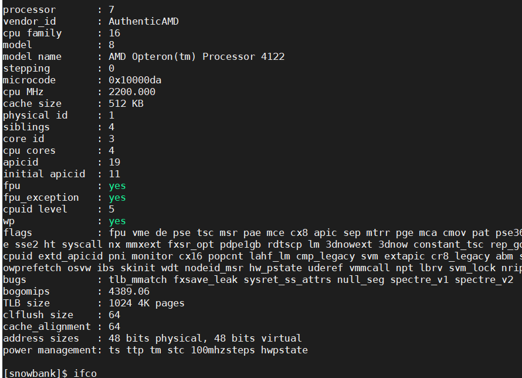
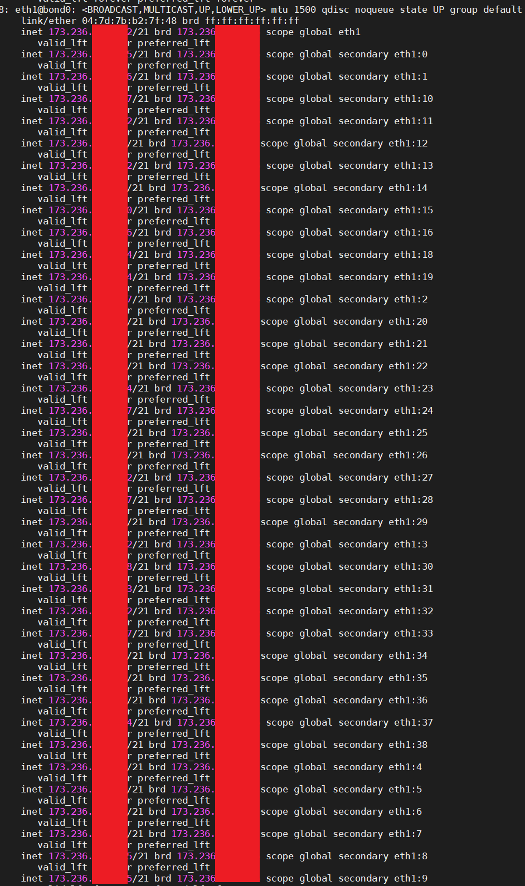
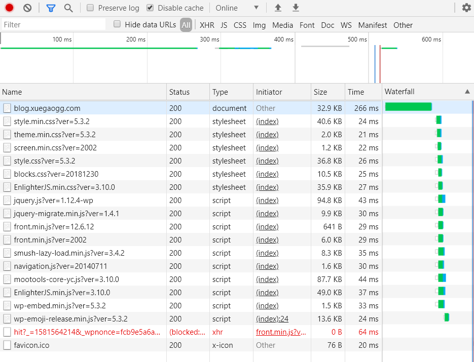
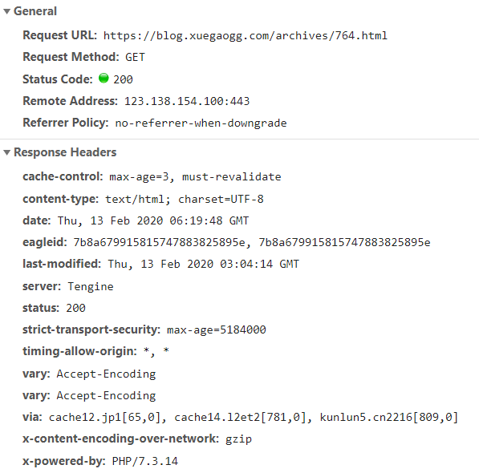
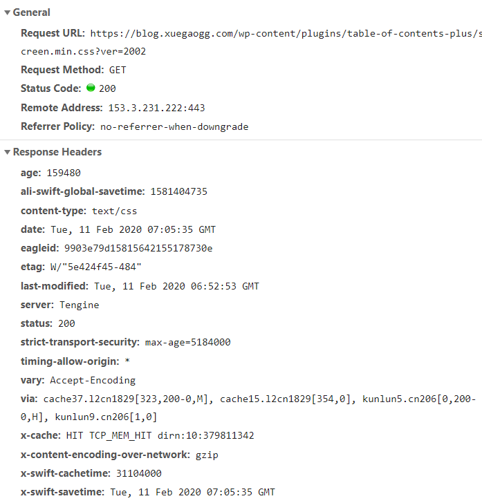

---
aliases:
- /archives/881
categories:
- CDN
date: 2020-02-13 06:36:04+00:00
draft: false
title: WordPress全站优化指南
---

众所周知，WordPress以庞大和臃肿著称，如何提高用户访问体验一直以来是一个问题。本篇文章结合本站的优化方式进行了探讨

**注意：此优化方式仅在本站进行了有限测试，实际部署请根据实际情况进行调整。**

## 服务端优化

可以看这篇：<https: 851.html="" archives="" blog.xuegaogg.com="">

## 源站基础设施优化

说白了就是加钱上更贵的服务。

在此，**我非常不建议购买DreamHost家的服务**，原因有两点：服务器非常垃圾，客服非常糟糕。

我买了Starter Shared一年期，47.40美金的价钱真的是完全能够去Vultr租一年VPS了，建议有运维能力的还是自己租服务器吧。这家的服务器有多烂呢，这都2020年了，来看看人家的服务器

<figure class="aligncenter size-large">

<figcaption>图1. cat /proc/cpuinfo</figcaption></figure>

<figure class="aligncenter size-large">

<figcaption>图2. ip addr show的一部分</figcaption></figure>

从上边我们知道了这台服务器共8个核心，查了一下应该是两颗U。那么8个物理核，负载有多高呢？

<figure class="aligncenter size-large">

<figcaption>图3. 负载</figcaption></figure>

<figure class="aligncenter size-large">

<figcaption>图4. top</figcaption></figure>

我专程对比了网站的DNS记录的IP和上边的接口中的IP，确认了就是在这台服务器上。好端端一个8核的机器承受了它不该有的重担…当然满载不是常态，我唯独能说的，是这家服务商对计算资源利用得还挺好……

其实这种行为叫做超售，一般服务商都会超售20%左右，确保整台服务器能够充分利用计算资源，但是超售太多了就不太好了。我无法直接一口咬定服务商超售，因为短时的观察并不能说明问题，但是好歹我也找到了我托管在这家服务商的站点都非常慢的原因。

提到这个不得不提及一下IO，这家服务商的服务器的磁盘IO怎么样呢，我在他们的服务器上压缩我的站点内容，压缩过程持续了大约3分钟，然而这个压缩包在我的Vultr上解压只花费了不到10秒，虽然不得不考虑CPU那时候已经爆掉了的可能，但是这也差太多了吧？

其次再来说技术支持，这家服务商是我唯独一家找不到历史工单记录的，我有点迷。起初购买服务时，发工单，平均18-24h左右间隔才回复，还有一次发的工单到现在还没回复，由于这家的工单系统是真的很烂，也不排除我发的不是工单，反正截止到目前为止我还没有收到回复，应该有4个月了吧，嗯。

所以我换Vultr了。一个月6美金的高主频VPS（频率3792.000MHz，二级缓存16384 KB，Bogomips:7584.00），数据中心位于日本东京，1G的内存+1T的流量，32G的NVME存储，实际使用了几天感觉还是挺香的。

<figure class="aligncenter size-large">

<figcaption>图5. Vultr 6美刀CPU</figcaption></figure>

<figure class="aligncenter size-large">

<figcaption>图6. Vultr 6美刀内存和负载</figcaption></figure>

除了内存小了一点，其他都是还不错的，服务器上软件稍微调教一下还是能利用好这算力的。

感兴趣的可以Vultr看看：<https: ?ref="6848239" www.vultr.com=""> ，顺便帮我拉点返利吧

## 边缘访问优化

### 使用CDN

这里我需要特别提示的一点是，如果你的CDN在用阿里云的情况下，能尽量使用**全站加速**就尽量使用，不要使用阿里云的普通CDN，这一点对于源站在海外的朋友们更重要。

之前使用阿里云普通CDN的时候，回源经常需要2-6秒，非常慢，后来换到了阿里云的全站加速才大幅度缓解。根据官方的文档的说法，全站加速动态回源会直接通过骨干网走最优路由回源，而这就意味着普通CDN动态回源**很可能**是集中回源，路由可能不是最优的。这也很好地解释了为什么起初我的源站在美国时首页加载延迟几乎拉到了8秒…即便是换到了Choopa日本的情况下，经过CDN的延迟仍然不如直接访问。

在配置伪静态并且关闭了评论后，在CDN对所有html套上了一层10分钟的缓存，用于在密度稍大的访问情景中减少服务器负载并提高访问质量。

### 加速DNS查询

可以参考这里： <https: dns-providers-list="" www.dnsperf.com=""></https:> 

其实我的域名也是想托管到Cloudflare去的，但是迁移完记录之后想起来，我还有一些依赖DNS API的服务…所以只能购买了阿里云的DNS解析企业版，这东西提供了更多的DNS查询质量保障，不过实测好像并没有多大提升。建议一开始能用Cloudflare就别用阿里云了

对DNS查询速度做了评估，这一查询大概要浪费10-50ms左右的时间，如果能在DNS做好功夫，哪怕降一点延迟，整个访问体验也有一定的提升。

## 插件优化

### <strong>All In One WP Security</strong>

类型：安全插件

能提供一些登录锁定、文件权限和基本的防火墙功能，同时也可以实现重命名登录页，还算是挺实用的

### <strong>Disable Comments</strong> 

禁用评论插件，由于全站开启缓存的情况下，WP的评论容易被一同带入缓存导致刷不出新评论，并且WP的评论实在是太垃圾了还不如外挂的，因此可以用这个插件一键禁用。

### Disable Google Fonts

敲黑板：Google的字体一定要禁用掉，否则对加载速度会产生巨大影响。

由于Google的服务在国内一直是处于被墙的状态，包括Fonts也不例外，加载非常慢，而WP前端渲染又必须要依靠这个字体，很容易导致页面长时间卡渲染的问题，所以建议直接禁用掉所有的Google字体。

### <strong>Enlighter——可自定义的语法高亮显示插件</strong> 

这个就不多说了吧，看名字就知道了，程序猿必备。

### <strong>Smush</strong>

这个工具是SEO优化用的，我只用到了它的一个功能——Lazy load，即懒加载。

Lazy load能减少CDN的流量开销，避免全站一口气出图，不仅能加速页面渲染，还能省钱，同时也是提高SEO排名的好办法。

### Table of Contents Plus

自动生成目录插件。

### WP Super Cache

缓存插件，主要用于生成文章的静态缓存，一次访问后缓存开到了30天，一定程度上能减少源站压力提高访问速度。并且自带gzip压缩和304缓存支持，也支持预先缓存，只是我没开而已。

### WP 统计

统计插件

### WPJAM BASIC

国人出的一款SEO优化插件，是个不错的插件，有很多选项可以帮助优化速度。

## 代码优化

这也是我最想做的，可是并不会php也懒得去学这语言，就这样吧先。

## 实测数据

说真的，以前博客的加载速度几乎稳定在5秒以上，基本都在7秒左右，这就意味着，当你打开页面，你要等啊等啊等…等够7秒才能出内容，尽管只有第一个动态元素会浪费很长时间，其他的都被CDN几十毫秒就出了，但整体质量已经摆在这里了…

经过连续几天的迁移和优化后，全站的加载速度已经到达了比较理想的地步，虽然不及百度和淘宝的加载速度，但是也相对之前有了很大提升。

<figure class="aligncenter size-large">

<figcaption>图7. 优化后全站的加载速度</figcaption></figure>

<figure class="aligncenter size-large">

<figcaption>图8. CSDN全站加载速度</figcaption></figure>

如上两个图可以看到，第一个动态元素的加载延迟基本和CSDN的平齐，即便差也不会差太大，但是全站元素少因此比CSDN更快得完成了加载（600ms不到）。

<figure class="aligncenter size-large">

<figcaption>图9. html响应头</figcaption></figure>

<figure class="aligncenter size-large">

<figcaption>图10. css响应头</figcaption></figure>

从上图9和10可以看到，阿里云全站加速对于动态资源的缓存并不是在边缘，如果将伪静态元素通过静态加速的方式，尽管短时（缓存命中的情况下）可以获得非常好的访问质量，但是未命中的情况下可能会比较糟糕。如图10的css元素，归属静态资源直接命中了边缘节点的缓存，因此22ms完成了加载，而图9中的伪静态元素由于配置为动态资源并部署了缓存，缓存并没有在边缘而在日本节点，因此取回存在了一定的延迟，但是仍然在可接受范围内。</https:></https:>